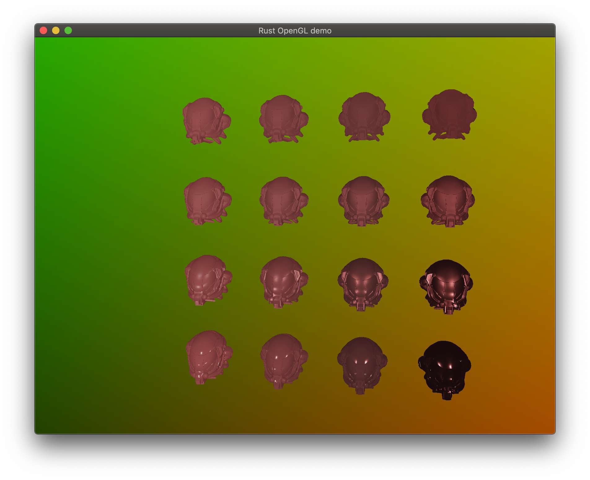

# Rust opengl demo

By Steve Shea

Still very much a work in progress, this project is a 3d renderer designed 
for multiple backends, including OpenGL and eventually Vulkan.

SlsEngine's shading model employs the Cook-Torrence BRDF, compatible with
gltf material descriptions

Screenshot: 

## Compilation and running

Currently, this project requires rust nightly for several nightly Rust features, as well as the
ability to use Cargo [profile-override features](https://doc.rust-lang.org/cargo/reference/unstable.html)
(certain 3rd party crates are unreasonably slow without optimizations enabled in debug mode). Executing

```bash
cargo run
```

in the root directory runs the demo. While not used in the OpenGL demo, I've included a makefile for processing assets,
specifically compiling vulkan shaders to SPIRV. The git repo contains precompiled shader binaries for Vulkan.